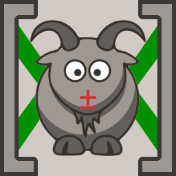

# 🎄 Advent Of Code

This repository contains my [Advent of code](https://adventofcode.com) solutions solved in different programming languages.

## [2023](https://adventofcode.com/2023)

**Languages: [ Python](languages/py/2023): 11, [ Brainfuck](languages/bf/2023): 3, [ JavaScript](languages/js/2023): 2**

| Mo | Tu | We | Th | Fr | Sa | Su |
| :-: | :-: | :-: | :-: | :-: | :-: | :-: |
|  |   |   |  | **[1](https://adventofcode.com/2023/day/1)**   | **[2](https://adventofcode.com/2023/day/2)**   | **[3](https://adventofcode.com/2023/day/3)**  |
| **[4](https://adventofcode.com/2023/day/4)**  | **[5](https://adventofcode.com/2023/day/5)** | **[6](https://adventofcode.com/2023/day/6)** | **[7](https://adventofcode.com/2023/day/7)** | **[8](https://adventofcode.com/2023/day/8)** | **[9](https://adventofcode.com/2023/day/9)** | **[10](https://adventofcode.com/2023/day/10)**  |
| **[11](https://adventofcode.com/2023/day/11)** | 12 | 13 | 14 | 15 | 16 | 17  |
| 18 | 19 | 20 | 21 | 22 | 23 | 24  |
| 25 |   |   |   |   |   |   |

